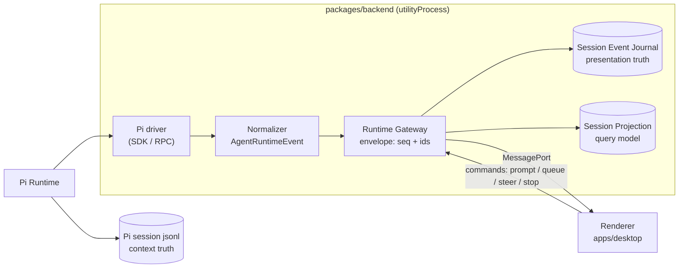

# PiGUI

English | [简体中文](README.zh-CN.md)

> The missing GUI for [Pi Agent](https://pi.dev).

Pi has a VS Code-like extension system — but no screen. PiGUI is that screen: a desktop app that turns everything Pi's runtime and plugin ecosystem produces — sessions, traces, costs, tool calls, and eventually plugin panels and dynamic workflows — into a visual, operable interface, layered with abilities a terminal can never offer.

## Vision

PiGUI is built as three layers:

1. **Visualize** — give every capability in Pi's ecosystem a face. Session traces — legible timelines with cost and token truth — are the first visualization type, not the product. Plugin-provided panels and dynamic workflow views come next.
2. **Operate** — the agent-workspace control plane underneath: create, drive, steer, fork, and resume Pi sessions across projects and git worktrees. Pi remains the only runtime and owns session truth; PiGUI observes and steers it through a stable Runtime Gateway API.
3. **Augment** — GUI-native abilities the terminal can't host, in the spirit of Codex's desktop app: an embedded browser with a DOM-annotation mode, and structured action surfaces in place of a terminal emulator.

Already today, PiGUI answers in seconds the three questions the terminal hides:

- **How much did this cost?**
- **Which step was expensive?**
- **What was Pi actually thinking?**

### Roadmap themes

- **Plugin surfaces** — a protocol for Pi extensions to declare their own visualization panels, routed through the same event pipeline. The `surface` routing in the architecture below is the designed seam; the Extension-UI gateway protocol is a tracked capability gap in [ADR-0018](docs/adr/0018-runtime-gateway-api-and-pi-drivers.md).
- **Embedded browser annotation** — preview pages and annotate DOM elements to feed precise UI feedback back to Pi. This is the load-bearing reason for the Electron shell ([ADR-0013](docs/adr/0013-electron-shell-and-relocatable-backend.md)).
- **Dynamic workflow visualization** — when Pi runs multi-step or multi-agent workflows, render them as live, inspectable views instead of interleaved logs.

## Status

🛠️ **Under active development.** The Electron shell, the Runtime Gateway API, the drivers, and the agent-workspace foundation (sessions, run controls, fork/resume, runtime projections) have landed; usage and config surfaces are in flight. A full terminal emulator and file tree are deliberately deferred.

The product began as a passive session-replay tool and has since evolved into an **Agent Workspace Control Plane** for Pi (see [`docs/adr/0001`](docs/adr/0001-agent-workspace-control-plane.md)). The living source of truth is the domain glossary and the ADRs:

- **Glossary:** [`CONTEXT.md`](CONTEXT.md)
- **Decisions:** [`docs/adr/`](docs/adr/)
- **Feature PRDs:** [`.scratch/<feature>/PRD.md`](.scratch/) (point-in-time planning records)

## Stack

- **Shell:** Electron — a thin `main` process, a Node `utilityProcess` backend (session-log parsing + Pi runtime driver management), and a React renderer (see [`docs/adr/0013`](docs/adr/0013-electron-shell-and-relocatable-backend.md))
- **Frontend:** Vite + React + TypeScript SPA, TanStack (Query/Table/Virtual/Router)
- **Styling:** CSS-variable design tokens (single source of truth) → Tailwind v4 → own component primitives
- **Tooling:** Bun workspaces, electron-vite, Vitest

## Architecture

**The dashboard must never stall the engine.** Pi owns session truth; PiGUI observes and steers it through a stable Runtime Gateway API. The backend lives in a `utilityProcess` so runtime crashes and heavy parsing work never freeze the window, and the same backend protocol can later be relocated behind a remote transport without touching business code.

The whole system is one unidirectional event pipeline, plus two persistence tracks that must never swap roles ([ADR-0021](docs/adr/0021-session-fork-resume-persistence-layering.md)):

- **Pi session jsonl** (`~/.pi`) is *context truth*: on cold resume, Pi rebuilds the LLM context from it itself — PiGUI never assembles LLM context.
- **Session Event Journal** (`~/.pigui`) is *presentation truth*: the UI timeline, run/turn identity, and control events only come from replaying it.
- Every event carries a `surface` stamp (`chat | trace | status | composer | hidden`) that routes it to its visualization — today a closed set, and the designed extension point for plugin-declared panels tomorrow.

### Where things live

| To change… | Go to… |
|---|---|
| UI, pages, interactions | [`apps/desktop/src/`](apps/desktop/src/) — FSD layers: `pages` → `entities` → `shared` ([ADR-0016](docs/adr/0016-fsd-layers-in-apps-desktop.md)) |
| Event semantics (what counts as a message / run / turn) | [`packages/backend/src/gateway/agent-runtime-event-normalizer.ts`](packages/backend/src/gateway/) + its fixture tests ([ADR-0020](docs/adr/0020-agent-runtime-event-model.md)) |
| Gateway protocol (commands, event contract, identity) | [`packages/core/src/`](packages/core/src/) — `runtime-gateway.ts`, `agent-runtime-event.ts` |
| How Pi is driven | [`packages/backend/src/drivers/`](packages/backend/src/drivers/) — `pi-sdk-driver.ts` is the main path; the RPC driver is frozen ([ADR-0018](docs/adr/0018-runtime-gateway-api-and-pi-drivers.md), [ADR-0021](docs/adr/0021-session-fork-resume-persistence-layering.md)) |
| Persistence & replay (journal, projection) | [`packages/backend/src/persistence/`](packages/backend/src/persistence/) |
| Sessions on disk, git worktrees, config inventory | [`packages/backend/src/workspace/`](packages/backend/src/workspace/) |
| Electron shell & transport | [`apps/desktop/electron/`](apps/desktop/electron/) — `main.ts`, `preload.ts`, `backend.ts` |
| Why it is designed this way | [`docs/adr/`](docs/adr/) — terms in [`CONTEXT.md`](CONTEXT.md) |

`apps/server` and `apps/web` are intentional placeholders for the relocatable backend's future remote transport — see their READMEs and [ADR-0015](docs/adr/0015-multi-app-monorepo.md).

### How a prompt flows

What happens when you hit <kbd>Enter</kbd> in the composer:

1. The renderer sends `send_prompt` through the Runtime Gateway client — `apps/desktop/src/entities/runtime/runtime-gateway-client.ts`.
2. The command crosses the MessagePort transport into the `utilityProcess` — `apps/desktop/electron/preload.ts`, `backend.ts`.
3. `createBackendService()` dispatches it to the Runtime Gateway — `packages/backend/src/service.ts`.
4. The Gateway mints the user message id and forwards to the active driver — `packages/backend/src/gateway/runtime-gateway.ts`.
5. The SDK driver drives Pi's `AgentSession`; Pi runs the agent loop — `packages/backend/src/drivers/pi-sdk-driver.ts`.
6. Raw Pi events are normalized into `AgentRuntimeEvent`s (phase, surface, deterministic run/turn/message ids) — `packages/backend/src/gateway/agent-runtime-event-normalizer.ts`.
7. The Gateway stamps each event into a sequenced envelope, journals lifecycle boundaries, and updates the session projection — `packages/backend/src/persistence/`.
8. Events stream back over the same transport; the renderer's projection routes them by `surface` into Live Chat bubbles, the trace panel, or hidden state — `apps/desktop/src/entities/runtime/`.

The best entry point for understanding (and contributing to) the system is the normalizer's fixture contract tests — they are the executable spec of the event protocol. Adding a new fixture stream is a great first PR.

---

Built in public by [@Kieran](https://github.com/BubblePtr).
