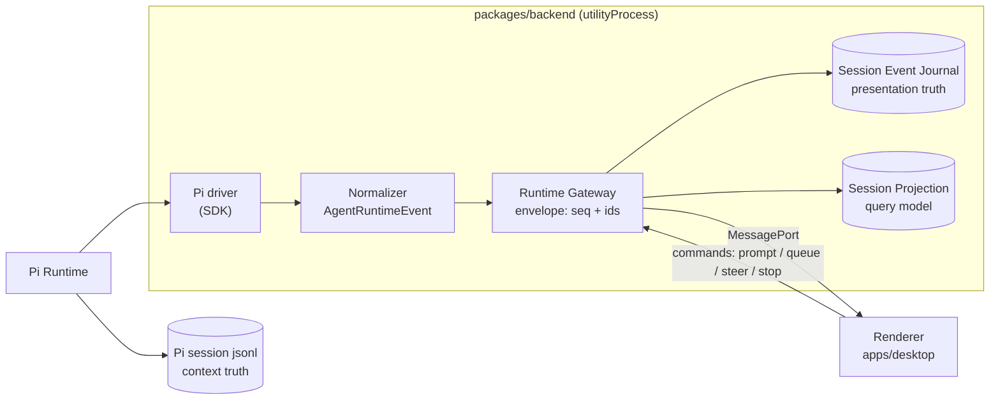

<p align="center">
  
</p>
<h1 align="center">Pace</h1>
<p align="center">The GUI for the <a href="https://pi.dev">Pi coding agent</a>. Pi's extensibility, on a screen.</p>

<p align="center">English | <a href="README.zh-CN.md">简体中文</a></p>

<p align="center">
  <a href="https://github.com/BubblePtr/pace/releases/latest"></a>
  <a href="https://github.com/BubblePtr/pace/releases/latest"></a>
  <a href="https://github.com/BubblePtr/pace/actions"></a>
</p>

Pi is a terminal coding agent with a VS Code-like extension system: packages contribute tools, commands, skills, prompts and themes. We want to bring that same flexibility to the desktop, so that everyone can shape a desktop agent that is truly their own. The name stands for *move at your own pace*: in the age of AI, individuals should keep full ownership of how they use an agent, customizing it and setting their own rhythm.

Pace is not a fork of Pi and not a second runtime. Pi stays the only engine and the only owner of session truth; Pace observes and steers it through a stable Runtime Gateway.

## What Pace is

- **Pi owns the truth.** Pi's session log (`~/.pi`) is the context truth: on resume, Pi rebuilds the LLM context from it by itself. Pace never assembles a prompt and never edits that log. Everything Pace persists is a projection of what Pi emitted, kept in its own directory.
- **The event journal is the UI.** Every Pi event is normalized into an `AgentRuntimeEvent`, stamped with a sequence number and deterministic run / turn / message ids, and journaled. The live timeline, cold replay, cost and token accounting are all derived from that journal, never from renderer state.
- **Harness behavior comes from extensions, not from source.** The GUI has a small set of built-in surfaces, but every routing seam (event `surface` stamps, the Dock surface registry, the Runtime Gateway capability model) is designed so that a Pi extension can contribute a view, a control or a workflow visualization without a Pace release. This is the same bet [DeepSeek Harness](https://github.com/deepseek-ai/deepseek-harness) makes with "everything is a plugin"; where their plugin model proves out, Pace intends to borrow from it.
- **The dashboard never stalls the engine.** The backend runs in an Electron `utilityProcess`. Heavy log parsing and driver crashes cannot freeze the window, and the backend protocol is transport-agnostic so it can later sit behind a remote socket untouched.

What that buys you today, in seconds instead of grep: how much a session cost, which step was expensive, and what Pi was actually thinking.

## Get Pace

**Releases.** Signed and notarized macOS Apple Silicon builds are published on [GitHub Releases](https://github.com/BubblePtr/pace/releases). Download the DMG, drag to Applications, and let the in-app updater handle the rest (ADR-0033). Linux AppImage and deb targets exist in the packaging config but are not yet shipped as releases; Windows is not targeted.

**Requirements.** macOS 12 or later. Pi itself is bundled with the app (ADR-0031); you do not need a separate `pi` install, but if you have one, Pace shares its `~/.pi/agent` data, auth and extensions with it.

**First run.** Pace opens an environment preflight (ADR-0025) that checks the bundled Pi runtime, the data directory and provider auth, and shows exactly where it will write. Provider logins done in the Pi TUI while Pace is open show up without a restart.

## Build from source

```sh
git clone https://github.com/BubblePtr/pace.git pace
cd pace
bun install
bun run dev
```

Toolchain: Bun 1.3.x (workspaces, scripts), Node 24 (Electron's runtime and vitest), Electron 42. `bun run dev` starts electron-vite with hot reload. The dev instance writes to `~/.pace-dev` and a `-dev` suffixed userData profile, so it never touches the data of an installed copy; see [`docs/dogfooding.md`](docs/dogfooding.md) for the isolation rules that let you develop Pace with Pace.

Packaging:

```sh
bun run package:mac:unsigned   # unsigned .app + zip, for local testing
bun run dist:mac               # signed + notarized DMG (needs Apple credentials)
bun run dist:linux             # AppImage + deb (x64)
```

The full signing, notarization and release pipeline is documented in [`docs/release/macos.md`](docs/release/macos.md).

## Architecture

The system is one unidirectional event pipeline plus two persistence tracks that must never swap roles ([ADR-0021](docs/adr/0021-session-fork-resume-persistence-layering.md)):


```mermaid
flowchart LR
  subgraph backend["packages/backend (utilityProcess)"]
    D["Pi driver<br/>(SDK)"] --> N["Normalizer<br/>AgentRuntimeEvent"]
    N --> G["Runtime Gateway<br/>envelope: seq + ids"]
    G --> J[("Session Event Journal<br/>presentation truth")]
    G --> P[("Session Projection<br/>query model")]
  end
  Pi["Pi Runtime"] --> D
  Pi --> L[("Pi session jsonl<br/>context truth")]
  G -->|MessagePort| R["Renderer<br/>apps/desktop"]
  R -->|"commands: prompt / queue / steer / stop"| G
```

- **Drivers** wrap Pi. The SDK driver is the main path; an RPC driver exists and is frozen ([ADR-0018](docs/adr/0018-runtime-gateway-api-and-pi-drivers.md)).
- **Normalizer** turns raw Pi events into `AgentRuntimeEvent`s with a phase, a `surface` and deterministic ids ([ADR-0020](docs/adr/0020-agent-runtime-event-model.md)). Its fixture contract tests are the executable spec of the protocol.
- **Runtime Gateway** is the only API the renderer talks to: commands in, sequenced envelopes out. It advertises capabilities (model / thinking controls, queue, steer) so the UI follows what the runtime can do rather than assuming ([ADR-0024](docs/adr/0024-model-thinking-controls-follow-runtime-capabilities.md)).
- **Persistence** keeps the Session Event Journal (append-only, replayable) and the Session Projection (a query model for lists and summaries).
- **Renderer** routes each event by its `surface` stamp into Live Chat, the Trajectory (chain of thought and tool calls), status, or hidden state, and hosts the Session Dock where built-in and extension-provided surfaces live ([ADR-0032](docs/adr/0032-session-dock-and-trajectory-vocabulary.md)).

### How a prompt flows

1. The renderer sends `send_prompt` through the Runtime Gateway client (`apps/desktop/src/entities/runtime/runtime-gateway-client.ts`).
2. The command crosses the MessagePort into the `utilityProcess` (`apps/desktop/electron/preload.ts`, `backend.ts`).
3. `createBackendService()` dispatches it to the Runtime Gateway (`packages/backend/src/service.ts`).
4. The Gateway mints the user message id and forwards to the active driver (`packages/backend/src/gateway/runtime-gateway.ts`).
5. The SDK driver drives Pi's `AgentSession`; Pi runs the agent loop (`packages/backend/src/drivers/pi-sdk-driver.ts`).
6. Raw Pi events are normalized (`packages/backend/src/gateway/agent-runtime-event-normalizer.ts`).
7. The Gateway stamps each event into a sequenced envelope, journals lifecycle boundaries, and updates the projection (`packages/backend/src/persistence/`).
8. Events stream back over the same transport and the renderer routes them by `surface` (`apps/desktop/src/entities/runtime/`).

### Where things live

| To change… | Go to… |
|---|---|
| UI, pages, interactions | [`apps/desktop/src/`](apps/desktop/src/), FSD layers `pages` → `entities` → `shared` ([ADR-0016](docs/adr/0016-fsd-layers-in-apps-desktop.md)) |
| Event semantics (what counts as a message / run / turn) | [`packages/backend/src/gateway/agent-runtime-event-normalizer.ts`](packages/backend/src/gateway/) and its fixture tests |
| Gateway protocol (commands, event contract, identity) | [`packages/core/src/`](packages/core/src/): `runtime-gateway.ts`, `agent-runtime-event.ts` |
| How Pi is driven | [`packages/backend/src/drivers/`](packages/backend/src/drivers/) |
| Persistence and replay | [`packages/backend/src/persistence/`](packages/backend/src/persistence/) |
| Sessions on disk, git worktrees, config inventory | [`packages/backend/src/workspace/`](packages/backend/src/workspace/) |
| Electron shell and transport | [`apps/desktop/electron/`](apps/desktop/electron/): `main.ts`, `preload.ts`, `backend.ts` |
| Dock surfaces (Changes, Files, Terminal, Browser) | [`apps/desktop/src/shared/ui/session-dock/surface-registry.ts`](apps/desktop/src/shared/ui/session-dock/surface-registry.ts) |
| Design system rules | [`docs/design/`](docs/design/), ledger of self-built pieces in [`docs/self-built-ui.md`](docs/self-built-ui.md) |
| Why it is designed this way | [`docs/adr/`](docs/adr/), vocabulary in [`CONTEXT.md`](CONTEXT.md) |

## Extensibility: where the GUI meets Pi's extension system

Pi's layering is Package → Extension / Skill / Prompt / Theme. Pace does not restate or extend those terms; it only names what an extension contributes to the GUI. The seams that exist today:

- **`surface` on every event.** `chat | trace | status | composer | hidden` routes an event to its visualization. Today it is a closed set; it is the designed slot for extension-registered surfaces.
- **Dock surface registry.** Every panel in the Session Dock is a Surface with an id, title, icon and hint, declared in one registry (`surface-registry.ts`). Today the registry is a closed set of four built-ins (Changes, Files, Terminal, Browser); ADR-0032 reserves a `provider` field (`builtin` or a Pi extension id) so extension-contributed surfaces land in the same registry and rail rather than a second mechanism.
- **Runtime Gateway capabilities.** The UI already adapts to what the loaded runtime advertises. Extension UI requests from Pi's SDK are a tracked capability gap in the Gateway protocol ([ADR-0018](docs/adr/0018-runtime-gateway-api-and-pi-drivers.md)); closing it is the next step on this track.

Roadmap on this track, in order:

1. **Extension surfaces**: a protocol for a Pi extension to register a Dock surface fed by the same event pipeline.
2. **Dynamic workflow visualization**: when Pi runs multi-step or multi-agent work, render it as a live, inspectable view instead of interleaved logs.
3. **Harness tuning through extensions**: expose the pieces of Pace that shape the agent's behavior (composer injection, permission surfaces, run controls) as extension points, so tuning the harness is a package you install rather than a patch to this repo.

Alongside, the GUI-native track that a terminal cannot host: the embedded browser with DOM annotation ([ADR-0029](docs/adr/0029-embedded-browser-surface.md)) is the load-bearing reason for the Electron shell.

## Repository layout

```
apps/desktop/        Electron app: electron/ (main, preload, backend host) + src/ (React, FSD)
apps/server/         placeholder: headless backend behind a WebSocket (ADR-0015)
apps/web/            placeholder: browser client for apps/server
packages/core/       shared kernel: gateway protocol, event model, session types (ADR-0014)
packages/backend/    drivers, gateway, persistence, workspace; service.ts is the composition root
e2e/                 Playwright smoke tests against the real Electron app
build/               icons, entitlements, Icon Composer source
scripts/             release, packaging and runtime-bundling scripts
docs/                ADRs, design system rules, release and dogfooding guides
CONTEXT.md           the domain glossary; every UI region and concept has a term here
```

Stack: Electron + electron-vite, React 19, TypeScript, TanStack (Query / Router / Virtual), Tailwind v4 over the Astryx design system, Bun workspaces, Vitest, Playwright.

## Local data and recovery

| Data | Installed app | `bun run dev` | Owner |
| --- | --- | --- | --- |
| Pi sessions, auth, extensions | `~/.pi/agent` | shared | Pi. Pace only reads. |
| Session journal, projections, preflight state | `~/.pace` | `~/.pace-dev` | Pace. Override with `PACE_DATA_DIR` (`PIGUI_DATA_DIR` is a deprecated alias). |
| Renderer preferences (project registry, drafts, model choice), Chromium profile | Electron userData | userData `-dev` | Pace. |

Deleting Pace's data directory loses the UI timeline and cost history but never a Pi session: Pi can still resume from its own log. Any change to the journal or projection format must read the previous format or ship a migration ([`docs/dogfooding.md`](docs/dogfooding.md)).

## Development and verification

```sh
bun run typecheck        # tsc --noEmit across the workspace
bun run test             # vitest: unit + contract tests (normalizer fixtures, gateway, persistence)
bun run test:e2e         # Playwright smoke tests against the dev Electron build
bun run test:release     # release script and publish behavior tests
bun run build            # typecheck + electron-vite build
```

Before opening a PR, `typecheck`, `test` and `build` must be green; the manual `Validate macOS ARM64` workflow runs packaging and the packaged-app E2E on demand.

Two dev-only tools help when working on UI:

- `/design` is the living registry of the design system; every component in `shared/ui/` is shown there with all its variants and states.
- The **UI intent picker** (floating crosshair, or `Cmd/Ctrl+Shift+X`) copies, for any element, its CONTEXT.md term, component stack with file:line and nearest `data-testid` ([`docs/ui-intent-picker.md`](docs/ui-intent-picker.md)).

Never run the terminal pty driver under Bun; the backend runs on Node in production and Bun's Node-API breaks `node-pty`.

## Documentation

- [`CONTEXT.md`](CONTEXT.md): domain glossary. Terms here are the names used in code, tests and issues.
- [`docs/adr/`](docs/adr/): architecture decision records, from the control-plane pivot ([ADR-0001](docs/adr/0001-agent-workspace-control-plane.md)) to the current surfaces.
- [`docs/design/`](docs/design/): which tokens, which Astryx variants, which self-built components.
- [`docs/release/macos.md`](docs/release/macos.md), [`docs/dogfooding.md`](docs/dogfooding.md): shipping and daily-driving Pace.
- [`docs/agents/`](docs/agents/): how issues, triage labels and domain docs are organized for both human and agent contributors.
- [`.scratch/<feature>/PRD.md`](.scratch/): point-in-time product requirement records.

## Contributing

- **Issues** live on GitHub Issues. Labels follow a five-role triage vocabulary (`needs-triage`, `needs-info`, `ready-for-agent`, `ready-for-human`, `wontfix`); pick up anything marked `ready-for-human`.
- **Branches and PRs.** Work on `feat/`, `fix/` or `chore/` branches; `main` is the only long-lived branch and releases are tags. Dependent PRs use `gh stack`. Commits follow Conventional Commits.
- **Decisions.** A change that alters an architectural boundary or a product term ships with an ADR and, if it touches vocabulary, a CONTEXT.md update in the same PR.
- **UI.** Reusable components go in `apps/desktop/src/shared/ui/` and are registered on `/design` in the same PR. Tokens come from the semantic bridge, never hard-coded.
- **A good first PR** is a new fixture stream for the event normalizer: record a Pi session, add the fixture, assert the normalized events. It exercises the whole protocol without touching UI.

See [CONTRIBUTING.md](CONTRIBUTING.md), [CODE_OF_CONDUCT.md](CODE_OF_CONDUCT.md) and [SECURITY.md](SECURITY.md). [`AGENTS.md`](AGENTS.md) holds the full contributor rules; it is written to be followed by humans and coding agents alike.

## License

Pace is released under the [Apache License 2.0](LICENSE). The Pace name and icon are not covered by that grant. Pi is a separate project with its own license.
