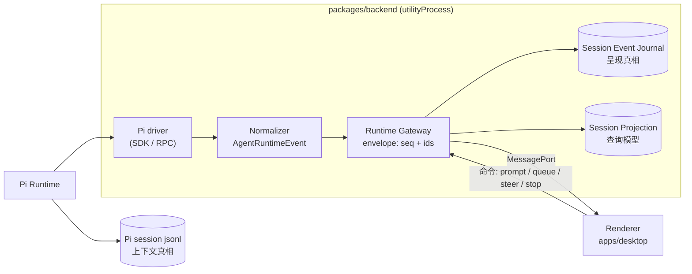

# PiGUI

[English](README.md) | 简体中文

> [Pi Agent](https://pi.dev) 缺失的那块 GUI。

Pi 有一个像 VS Code 一样的扩展体系，却没有一块屏幕。PiGUI 就是那块屏幕：一个桌面应用，把 Pi 运行时和插件生态产出的一切——会话、trace、成本、工具调用，未来还有插件面板和动态工作流——变成可视、可操作的界面，并叠加终端永远给不了的能力。

## 愿景

PiGUI 由三层构成：

1. **可视化（Visualize）**——给 Pi 生态里的每种能力一张脸。带成本与 token 真相的会话 trace 时间线只是第一种可视化类型，不是产品本体；插件提供的面板和动态工作流视图是下一步。
2. **操作（Operate）**——底层的 agent 工作空间控制平面：跨 Project 和 git worktree 创建、驱动、steer、fork 和恢复 Pi 会话。Pi 始终是唯一运行时并拥有会话真相；PiGUI 通过稳定的 Runtime Gateway API 观察和驾驭它。
3. **增强（Augment）**——终端承载不了的 GUI 原生能力，与 Codex 桌面应用同一思路：带 DOM 批注模式的内嵌浏览器、替代终端模拟器的结构化操作面。

今天，PiGUI 已经能让你在几秒内回答终端隐藏的三个问题：

- **这次花了多少钱？**
- **哪一步最贵？**
- **Pi 当时到底在想什么？**

### Roadmap 主题

- **插件 surface**——让 Pi 扩展声明自己的可视化面板的协议，走同一条事件流水线路由。下方架构中的 `surface` 路由就是预留的接缝；Extension-UI 的 gateway 协议是 [ADR-0018](docs/adr/0018-runtime-gateway-api-and-pi-drivers.md) 中已记录的 capability 缺口。
- **内嵌浏览器批注**——预览页面并批注 DOM 元素，把精确的 UI 反馈喂回给 Pi。这是选择 Electron 外壳的承重理由（[ADR-0013](docs/adr/0013-electron-shell-and-relocatable-backend.md)）。
- **动态工作流可视化**——当 Pi 执行多步骤或多 agent 工作流时，渲染为实时可检视的视图，而不是交错的日志。

## 状态

🛠️ **开发进行中。** Electron 外壳、Runtime Gateway API、双 driver，以及 agent 工作空间基础（会话、运行控制、fork/resume、runtime 投影）均已落地；用量与配置界面开发中。完整的终端模拟器和文件树被有意推迟。

产品最初是一个被动的会话重放工具，现已演进为面向 Pi 的 **Agent 工作空间控制平面**（见 [`docs/adr/0001`](docs/adr/0001-agent-workspace-control-plane.md)）。活的权威来源是领域词汇表和 ADR：

- **词汇表：** [`CONTEXT.md`](CONTEXT.md)
- **决策记录：** [`docs/adr/`](docs/adr/)
- **功能 PRD：** [`.scratch/<feature>/PRD.md`](.scratch/)（时点性的规划记录）

## 技术栈

- **外壳：** Electron——极薄的 `main` 进程、Node `utilityProcess` 后端（会话日志解析 + Pi 运行时 driver 管理）、React 渲染进程（见 [`docs/adr/0013`](docs/adr/0013-electron-shell-and-relocatable-backend.md)）
- **前端：** Vite + React + TypeScript SPA，TanStack（Query/Table/Virtual/Router）
- **样式：** CSS 变量设计令牌（单一事实来源）→ Tailwind v4 → 自有组件原语
- **工具链：** Bun workspaces、electron-vite、Vitest

## 架构

**仪表盘永远不能让发动机熄火。** Pi 拥有会话真相；PiGUI 通过稳定的 Runtime Gateway API 观察和驾驭它。后端运行在 `utilityProcess` 中，运行时崩溃和繁重的解析工作永远不会冻结窗口；同一套后端协议未来可以搬到远程 transport 后面而不触碰业务代码。

整个系统是一条单向事件流水线，外加两条永不互换角色的持久化轨道（[ADR-0021](docs/adr/0021-session-fork-resume-persistence-layering.md)）：

- **Pi session jsonl**（`~/.pi`）是*上下文真相*：冷恢复时 Pi 自己从中重建 LLM 上下文——PiGUI 永不自行拼装 LLM 上下文。
- **Session Event Journal**（`~/.pigui`）是*呈现真相*：UI 时间线、run/turn identity 和控制事件只来自对它的回放。
- 每个事件都带 `surface` 标记（`chat | trace | status | composer | hidden`），路由到它所属的可视化面——今天是封闭集合，明天就是插件声明自有面板的预留扩展点。

### 代码在哪里

| 想改… | 去… |
|---|---|
| UI、页面、交互 | [`apps/desktop/src/`](apps/desktop/src/)——FSD 分层：`pages` → `entities` → `shared`（[ADR-0016](docs/adr/0016-fsd-layers-in-apps-desktop.md)） |
| 事件语义（什么算一条 message / run / turn） | [`packages/backend/src/gateway/agent-runtime-event-normalizer.ts`](packages/backend/src/gateway/) + 它的 fixture 测试（[ADR-0020](docs/adr/0020-agent-runtime-event-model.md)） |
| Gateway 协议（命令、事件契约、identity） | [`packages/core/src/`](packages/core/src/)——`runtime-gateway.ts`、`agent-runtime-event.ts` |
| Pi 的接入方式 | [`packages/backend/src/drivers/`](packages/backend/src/drivers/)——`pi-sdk-driver.ts` 是主路径；RPC driver 已冻结（[ADR-0018](docs/adr/0018-runtime-gateway-api-and-pi-drivers.md)、[ADR-0021](docs/adr/0021-session-fork-resume-persistence-layering.md)） |
| 持久化与重放（journal、projection） | [`packages/backend/src/persistence/`](packages/backend/src/persistence/) |
| 磁盘上的会话、git worktree、配置清单 | [`packages/backend/src/workspace/`](packages/backend/src/workspace/) |
| Electron 外壳与 transport | [`apps/desktop/electron/`](apps/desktop/electron/)——`main.ts`、`preload.ts`、`backend.ts` |
| 为什么这么设计 | [`docs/adr/`](docs/adr/)——术语见 [`CONTEXT.md`](CONTEXT.md) |

`apps/server` 和 `apps/web` 是可重定位后端未来远程 transport 的有意占位——见各自的 README 和 [ADR-0015](docs/adr/0015-multi-app-monorepo.md)。

### 一条 prompt 的流转

在 composer 里按下 <kbd>Enter</kbd> 之后发生的事：

1. 渲染进程通过 Runtime Gateway client 发送 `send_prompt`——`apps/desktop/src/entities/runtime/runtime-gateway-client.ts`。
2. 命令经 MessagePort transport 进入 `utilityProcess`——`apps/desktop/electron/preload.ts`、`backend.ts`。
3. `createBackendService()` 把它分发给 Runtime Gateway——`packages/backend/src/service.ts`。
4. Gateway 铸造 user message id 并转发给当前 driver——`packages/backend/src/gateway/runtime-gateway.ts`。
5. SDK driver 驱动 Pi 的 `AgentSession`；Pi 执行 agent loop——`packages/backend/src/drivers/pi-sdk-driver.ts`。
6. Pi 原始事件被归一化为 `AgentRuntimeEvent`（phase、surface、确定性的 run/turn/message id）——`packages/backend/src/gateway/agent-runtime-event-normalizer.ts`。
7. Gateway 把每个事件盖进带序号的 envelope，将生命周期边界写入 journal，并更新 session projection——`packages/backend/src/persistence/`。
8. 事件沿同一 transport 流回；渲染进程的 projection 按 `surface` 把它们路由进 Live Chat 气泡、trace 面板或隐藏状态——`apps/desktop/src/entities/runtime/`。

理解（以及参与贡献）这个系统的最佳入口是 normalizer 的 fixture 契约测试——它们是事件协议的可执行规范。添加一条新的 fixture 事件流是一个很好的 first PR。

---

由 [@Kieran](https://github.com/BubblePtr) Build in Public。
