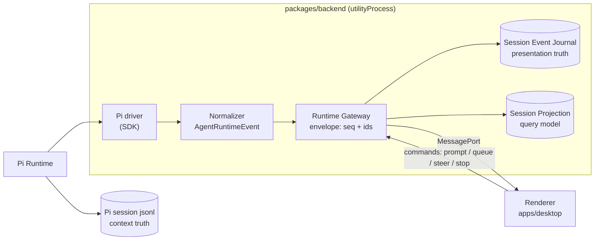

<p align="center">
  
</p>
<h1 align="center">Pace</h1>
<p align="center"><a href="https://pi.dev">Pi coding agent</a> 的桌面 GUI。把 Pi 的会话、思维链、费用和扩展面板放进一个窗口。</p>

<p align="center"><a href="README.md">English</a> | 简体中文</p>

<p align="center">
  <a href="https://github.com/BubblePtr/pace/releases/latest"></a>
  <a href="https://github.com/BubblePtr/pace/releases/latest"></a>
  <a href="LICENSE"></a>
</p>

Pace 面向已经在用 Pi 的开发者。Pi 是运行在终端里的 coding agent，带有类似 VS Code 的扩展体系：Package 提供 tool、command、skill、prompt 和 theme。Pace 把这套扩展性搬到桌面端，让你在图形界面里观察、驾驭和定制自己的 Agent。名字取自 *move at your own pace*：在 AI 时代，开发者应当对 Agent 保有完全的自主权，按自己的节奏开发与协作。

> [!NOTE]
> Pace 处于 `0.y.z` 早期阶段，只支持最新的 GitHub Release。journal 与 projection 的存储格式可能在小版本间变化，升级由应用内更新器完成；Pi 的会话数据不受影响（见[本地数据与恢复](#本地数据与恢复)）。

<!-- TODO(screenshot): 主界面截图，需同时看到 Live Chat、Trajectory 与费用统计。放到 docs/assets/readme/ 后替换本注释。 -->

## 亮点

- **会话费用与 Token 真相**：每一轮花了多少钱、用了多少 Token、哪一步最贵，直接显示在时间线上，不用事后翻日志。
- **Trajectory 执行轨迹**：思维链和工具调用按时间展开，能看到 Agent 每一步在想什么、做了什么。
- **历史回放**：任何一个 Pi 会话都能冷回放，时间线、费用、工具调用与实时观看时一致。
- **Session Dock 面板**：代码变更（Changes）、文件（Files）、终端（Terminal）、内嵌浏览器（Browser）挂在同一个侧边栏，Pi 扩展可以贡献自己的面板。
- **Pi 仍是唯一引擎**：Pace 不是 Pi 的 fork，也不是第二套运行时。会话真相始终在 Pi 的本地日志里，删掉 Pace 不会丢任何会话。

## 快速开始

### 安装

**预编译安装包（推荐）。** 已签名、已公证的 macOS Apple Silicon 构建发布在 [GitHub Releases](https://github.com/BubblePtr/pace/releases)。下载 DMG 拖入 Applications 即可，后续更新由应用内更新器接管（ADR-0033）。

**从源码运行。** 需要 Bun 1.3.x 与 Node 24：

```bash
git clone https://github.com/BubblePtr/pace.git pace
cd pace
bun install
bun run dev
```

**运行要求。** macOS 12 及以上，Apple Silicon。Pi 运行时已随应用内置（ADR-0031），无需单独安装 `pi`；若本机已装 Pi，Pace 会共享 `~/.pi/agent` 下的会话、认证与扩展。Linux 的 AppImage 与 deb 打包脚本已就绪但尚未正式发布；暂不支持 Windows。

### 第一次成功

1. 首次启动进入环境预检（ADR-0025）：检查内置 Pi 运行时、数据目录和模型提供商的认证状态，并明确显示数据会写到哪里。若还没登录任何提供商，在终端里完成 `pi` 的登录即可，Pace 运行期间会实时识别，无需重启。
2. 预检通过后，选择一个项目目录，新建会话。
3. 在输入框发出第一个 prompt，比如让它解释这个仓库的结构。
4. 看到的结果：Live Chat 里是对话；Trajectory 里是思维链和每一次工具调用；状态栏里是这一轮的 Token 与费用。这三样东西，就是终端里最难看到的部分。

<!-- TODO(screenshot): 第一次成功后的画面，对应上面第 4 步。 -->

## 什么时候不需要 Pace

- 你只在终端里用 Pi，不需要看费用、思维链或工具调用的可视化。
- 你的机器是 Windows，或 Intel Mac。目前只有 macOS Apple Silicon 构建。
- 你想要一个不依赖 Pi 的独立 Agent 客户端。Pace 不实现 Agent 循环，所有推理和上下文都由 Pi 完成。

## 设计原则

- **Pace 只是会话事件的投影，不侵入核心上下文。** Pi 的本地会话日志（`~/.pi`）是唯一事实来源，会话恢复时由 Pi 自己从中重建大模型上下文。Pace 不拼装 prompt，也不修改该日志；Pace 持久化的所有数据都是 Pi 事件流的投影，存放在自己的目录里。
- **界面完全由事件日志驱动。** Pi 的每个原始事件都被标准化为 `AgentRuntimeEvent`，分配单调递增的序号和确定的 run / turn / message ID，写入 journal。实时时间线、历史回放、Token 与费用统计都从 journal 推导，不依赖前端渲染状态。
- **面板与行为解耦，可由扩展驱动。** Pace 自身只内置少量核心面板（Surface）。事件路由、Session Dock 注册表和 Runtime Gateway 能力模型都按插件化设计：Pi 扩展不必等 Pace 发版就能注册自定义面板、控件或工作流视图。这与 [DeepSeek Harness](https://github.com/deepseek-ai/deepseek-harness) 的"一切皆插件"思路一致；其插件模型成熟后，Pace 会借鉴。
- **监控与交互不阻塞执行引擎。** 后端运行在 Electron 独立的 `utilityProcess` 中：繁重的日志解析和驱动崩溃都不会让窗口卡顿。后端协议与传输介质解耦，将来可以直接迁到远程 socket 后面。

## 架构

整个系统是一条单向事件流水线，加上两条职责永不互换的持久化轨道（[ADR-0021](docs/adr/0021-session-fork-resume-persistence-layering.md)）：


```mermaid
flowchart LR
  subgraph backend["packages/backend (utilityProcess)"]
    D["Pi driver<br/>(SDK)"] --> N["Normalizer<br/>AgentRuntimeEvent"]
    N --> G["Runtime Gateway<br/>envelope: seq + ids"]
    G --> J[("Session Event Journal<br/>presentation truth")]
    G --> P[("Session Projection<br/>query model")]
  end
  Pi["Pi Runtime"] --> D
  Pi --> L[("Pi session jsonl<br/>context truth")]
  G -->|MessagePort| R["Renderer<br/>apps/desktop"]
  R -->|"commands: prompt / queue / steer / stop"| G
```

- **Driver（驱动层）**：封装 Pi 运行时。SDK Driver 是默认主路径；RPC Driver 保留但已冻结（[ADR-0018](docs/adr/0018-runtime-gateway-api-and-pi-drivers.md)）。
- **Normalizer（标准化层）**：把 Pi 的原始事件转换为统一的 `AgentRuntimeEvent`，附加阶段（Phase）、目标展示区（Surface）和确定的消息 ID（[ADR-0020](docs/adr/0020-agent-runtime-event-model.md)）。录制的 Fixture 契约测试就是该协议的可执行规范。
- **Runtime Gateway（运行时网关）**：渲染层唯一对话的协议接口。上行接收控制命令，下行推送带单调递增序号的信封。网关声明当前运行时的能力集（模型切换、思维链控件、排队与引导），界面跟随运行时实际支持的功能，而非静态假设（[ADR-0024](docs/adr/0024-model-thinking-controls-follow-runtime-capabilities.md)）。
- **Persistence（持久化层）**：维护仅追加、可按时间线回放的 Session Event Journal，以及供列表和统计查询的 Session Projection。
- **Renderer（渲染层）**：按事件的 `surface` 标签分发到实时对话（Live Chat）、执行轨迹（Trajectory）、状态栏或隐藏态；同时承载 Session Dock 侧边栏，挂载内置与扩展贡献的面板（[ADR-0032](docs/adr/0032-session-dock-and-trajectory-vocabulary.md)）。

<details>
<summary>一条 prompt 的流转</summary>

1. 渲染层通过 Runtime Gateway Client 发起 `send_prompt`（`apps/desktop/src/entities/runtime/runtime-gateway-client.ts`）。
2. 命令经 MessagePort 跨进程通道转发至后端 `utilityProcess`（`apps/desktop/electron/preload.ts`、`backend.ts`）。
3. `createBackendService()` 将命令分发至 Runtime Gateway 实例（`packages/backend/src/service.ts`）。
4. Gateway 分配确定的用户消息 ID，转发给当前激活的 Driver（`packages/backend/src/gateway/runtime-gateway.ts`）。
5. SDK Driver 调用 Pi 的 `AgentSession`，驱动 Agent 执行循环（`packages/backend/src/drivers/pi-sdk-driver.ts`）。
6. Pi 的原始事件经 Normalizer 转换为标准格式（`packages/backend/src/gateway/agent-runtime-event-normalizer.ts`）。
7. Gateway 为每个事件赋予单调递增序号，记录生命周期边界，同步更新投影（`packages/backend/src/persistence/`）。
8. 事件经同一传输通道推回渲染层，按 `surface` 标签路由到对应界面组件（`apps/desktop/src/entities/runtime/`）。

</details>

<details>
<summary>代码在哪里</summary>

| 要改… | 去… |
| --- | --- |
| 界面、页面、交互 | [`apps/desktop/src/`](apps/desktop/src/)，FSD 分层 `pages` → `entities` → `shared`（[ADR-0016](docs/adr/0016-fsd-layers-in-apps-desktop.md)） |
| 事件语义（什么算 message / run / turn） | [`packages/backend/src/gateway/agent-runtime-event-normalizer.ts`](packages/backend/src/gateway/) 及其 fixture 测试 |
| Gateway 协议（命令、事件契约、身份） | [`packages/core/src/`](packages/core/src/)：`runtime-gateway.ts`、`agent-runtime-event.ts` |
| 怎么驱动 Pi | [`packages/backend/src/drivers/`](packages/backend/src/drivers/) |
| 持久化与回放 | [`packages/backend/src/persistence/`](packages/backend/src/persistence/) |
| 磁盘上的 Session、git worktree、配置清单 | [`packages/backend/src/workspace/`](packages/backend/src/workspace/) |
| Electron 外壳与传输 | [`apps/desktop/electron/`](apps/desktop/electron/)：`main.ts`、`preload.ts`、`backend.ts` |
| Dock Surface（Changes、Files、Terminal、Browser） | [`apps/desktop/src/shared/ui/session-dock/surface-registry.ts`](apps/desktop/src/shared/ui/session-dock/surface-registry.ts) |
| Resource Management（Setup）：Package、Resource、更新检查与 journal 诊断 | [`apps/desktop/src/pages/setup.tsx`](apps/desktop/src/pages/setup.tsx)、[`packages/backend/src/workspace/resource-management.ts`](packages/backend/src/workspace/resource-management.ts)、[`resource-diagnostics.ts`](packages/backend/src/workspace/resource-diagnostics.ts)（[ADR-0037](docs/adr/0037-resource-management.md)） |
| 设计系统规则 | [`docs/design/`](docs/design/)，自建组件清单见 [`docs/self-built-ui.md`](docs/self-built-ui.md) |
| 为什么这样设计 | [`docs/adr/`](docs/adr/)，术语在 [`CONTEXT.md`](CONTEXT.md) |

</details>

## 扩展机制：GUI 与 Pi 扩展生态的融合点

Pi 的扩展生态基于 `Package → Extension / Skill / Prompt / Theme` 体系。Pace 直接复用这一模型，只定义扩展能为桌面 GUI 贡献哪些视觉与交互能力。Setup 页提供 **Resource Management**：安装、卸载、更新 user scope 的 Package，开关其中的 Resource，把本地资源复制进 Pi 的约定目录；Package 行显示可用更新，Resource 详情显示最近活动 Session 的扩展错误。settings 变更在下一个新 Session 生效（[ADR-0037](docs/adr/0037-resource-management.md)）。

当前已落地的扩展点：

- **事件级别的 `surface` 路由标签**：事件携带的 `chat | trace | status | composer | hidden` 标签决定它在界面上如何呈现。目前是固定枚举集合，同时也是未来扩展面板的标准挂载插槽。
- **Session Dock 面板注册表**：侧边栏里的每块面板都是一个 Surface，有唯一 ID、标题、图标与提示，集中声明在 `surface-registry.ts`。当前有四个内置面板（Changes、Files、Terminal、Browser）。按 [ADR-0032](docs/adr/0032-session-dock-and-trajectory-vocabulary.md) 的设计，注册表预留了 `provider` 字段（`builtin` 或具体的 Pi 扩展 ID），外部扩展贡献的面板会挂到同一侧边栏，不另起机制。
- **Runtime Gateway 能力模型**：界面自适应当前运行时声明的能力。针对 Pi SDK 的"扩展界面交互请求（Extension UI request）"，网关已在协议层预留位置（[ADR-0018](docs/adr/0018-runtime-gateway-api-and-pi-drivers.md)），后续逐步补齐。

后续路线，按优先级：

1. **自定义面板协议（Extension Surface）**：标准化协议，让 Pi 扩展注册自定义面板，直接消费同一条事件流。
2. **多 Agent 动态工作流可视化**：Pi 执行多步骤任务或多 Agent 协作时，渲染为执行链路拓扑图，而非交错的文本日志。
3. **插件化运行时调优**：把 Pace 中影响 Agent 行为的控制项（提示词注入、权限管控、执行中断策略等）开放为扩展点，装一个 Package 就能定制 Agent 行为，不用改客户端仓库。

与此并行的是终端承载不了的 GUI 原生能力：具备 DOM 元素级批注与交互的内嵌浏览器（[ADR-0029](docs/adr/0029-embedded-browser-surface.md)），这也是 Pace 选择 Electron 的核心原因。

## 仓库布局

```plaintext
apps/desktop/        Electron 应用：electron/（main、preload、后端宿主）+ src/（React，FSD）
apps/server/         占位：WebSocket 后面的无头后端（ADR-0015）
apps/web/            占位：apps/server 的浏览器客户端
packages/core/       共享内核：gateway 协议、事件模型、session 类型（ADR-0014）
packages/backend/    drivers、gateway、persistence、workspace；service.ts 是组合根
e2e/                 针对真实 Electron 应用的 Playwright 冒烟测试
build/               图标、entitlements、Icon Composer 源工程
scripts/             发布、打包与运行时捆绑脚本
docs/                ADR、设计系统规则、发布与自举指南
CONTEXT.md           领域术语表；每个界面区域和概念在这里都有词条
```

技术栈：Electron + electron-vite、React 19、TypeScript、TanStack（Query / Router / Virtual）、基于 Astryx 设计系统的 Tailwind v4、Bun workspaces、Vitest、Playwright。

## 本地数据与恢复

| 数据 | 安装版 | `bun run dev` | 归属 |
| --- | --- | --- | --- |
| Pi 会话、认证、扩展 | `~/.pi/agent` | 共享 | Pi 持有会话真相；Pace 通过 SDK 管理 user scope 的资源配置并导入本地资源。 |
| Session journal、projection、预检状态 | `~/.pace` | `~/.pace-dev` | Pace。可用 `PACE_DATA_DIR` 覆盖（`PIGUI_DATA_DIR` 为已弃用别名）。 |
| 渲染层偏好（项目注册表、草稿、模型选择）、Chromium profile | Electron userData | userData `-dev` | Pace。 |

删除 Pace 的本地数据目录只会丢失界面历史与费用统计，不会损坏 Pi 的会话数据，Pi 随时可从自己的会话日志重建状态。任何调整 journal 或 projection 存储格式的变更，都必须能读旧格式或附带迁移脚本（见 [`docs/dogfooding.md`](docs/dogfooding.md)）。

## 开发与验证

工具链：Bun 1.3.x（workspace 与脚本）、Node 24（Electron 运行时与 vitest）、Electron 42。`bun run dev` 启动带热更新的 electron-vite。开发实例写入 `~/.pace-dev` 和带 `-dev` 后缀的 userData profile，不会碰已安装版本的数据；用 Pace 开发 Pace 的隔离规则见 [`docs/dogfooding.md`](docs/dogfooding.md)。

```bash
bun run typecheck        # 整个 workspace 的 tsc --noEmit
bun run test             # vitest：单元 + 契约测试（normalizer fixture、gateway、persistence）
bun run test:e2e         # 针对 dev Electron 构建的 Playwright 冒烟测试
bun run test:release     # 发布脚本与发布行为测试
bun run build            # typecheck + electron-vite build
```

开 PR 前 `typecheck`、`test`、`build` 必须全绿；手动的 `Validate macOS ARM64` workflow 按需执行打包和打包版 E2E。

打包：

```bash
bun run package:mac:unsigned   # 未签名 .app + zip，本地测试用
bun run dist:mac               # 签名 + 公证的 DMG（需要 Apple 凭据）
bun run dist:linux             # AppImage + deb（x64）
```

完整的签名、公证与发布流水线见 [`docs/release/macos.md`](docs/release/macos.md)。

做界面时有两个 dev-only 工具：

- 路由 `/design`：设计系统的实时组件展板，`shared/ui/` 下每个组件的全部变体与状态都在这里。
- **UI Intent Picker**：按 `Cmd/Ctrl+Shift+X` 激活准星，点击任意元素即可复制它对应的 CONTEXT.md 术语、源码组件调用栈（含文件与行号）和最近的 `data-testid`（见 [`docs/ui-intent-picker.md`](docs/ui-intent-picker.md)）。

> [!WARNING]
> 不要在 Bun 下直接调试终端 PTY 驱动。生产环境后端跑在 Node 上，Bun 当前的 Node-API 兼容层会让 `node-pty` 崩溃。

## 文档

- [`CONTEXT.md`](CONTEXT.md)：领域术语表。这里的词就是代码、测试和 issue 里用的名字。
- [`docs/adr/`](docs/adr/)：架构决策记录，从控制平面转向（[ADR-0001](docs/adr/0001-agent-workspace-control-plane.md)）到当前的各个 Surface。
- [`docs/design/`](docs/design/)：用哪些 token、哪些 Astryx 变体、哪些自建组件。
- [`docs/release/macos.md`](docs/release/macos.md)、[`docs/dogfooding.md`](docs/dogfooding.md)：发版与日常使用 Pace。
- [`docs/agents/`](docs/agents/)：issue、triage 标签和领域文档面向人类与 agent 贡献者的组织方式。
- [`.scratch/<feature>/PRD.md`](.scratch/)：某个时间点的产品需求记录。

## 支持与安全

- **Bug 与功能请求**：提交到 [GitHub Issues](https://github.com/BubblePtr/pace/issues)。
- **安全漏洞**：不要开公开 issue。按 [SECURITY.md](SECURITY.md) 的指引走 GitHub 私密安全通报，只支持最新 Release。
- **版本变化**：每个版本的更新说明在 [GitHub Releases](https://github.com/BubblePtr/pace/releases)。

## 参与贡献

- **Issue 协作**：任务与缺陷统一在 GitHub Issues 中跟进。标签采用五角色 triage 流转（`needs-triage`、`needs-info`、`ready-for-agent`、`ready-for-human`、`wontfix`）；标为 `ready-for-human` 的任务都可以认领。
- **分支与提交**：在 `feat/`、`fix/`、`chore/` 分支开发；`main` 是唯一长期分支，发布用 git tag。有依赖关系的 PR 用 `gh stack`。提交信息遵循 Conventional Commits。
- **架构决策记录**：改动架构边界或关键业务术语的变更要附 ADR；涉及概念定义的，在同一 PR 里同步更新 `CONTEXT.md`。
- **界面组件**：可复用组件放 `apps/desktop/src/shared/ui/`，并在同一 PR 里登记到 `/design` 展板。样式 token 走语义化桥接层，不硬编码。
- **适合的第一个 PR**：给事件 Normalizer 补一条 Fixture 测试：录一段 Pi 的原生会话日志，新增测试用例并断言转换后的标准事件。不涉及前端，能快速熟悉核心协议。

详见 [CONTRIBUTING.md](CONTRIBUTING.md)、[CODE_OF_CONDUCT.md](CODE_OF_CONDUCT.md) 和 [SECURITY.md](SECURITY.md)。[`AGENTS.md`](AGENTS.md) 是完整的贡献规则，写给人类和 coding agent 共同遵守。

## 许可证

Pace 以 [Apache License 2.0](LICENSE) 发布。Pace 的名称与图标不在该授权范围内。Pi 是独立项目，有自己的许可证。
