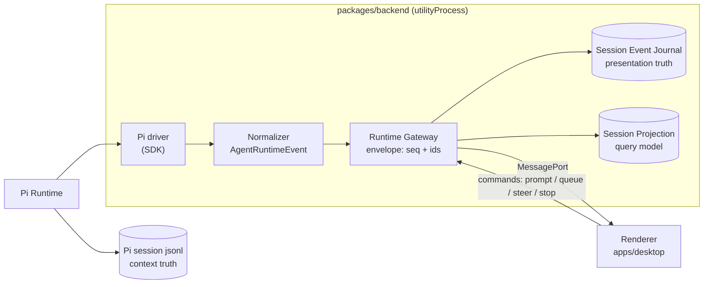

<p align="center">
  
</p>
<h1 align="center">Pace</h1>
<p align="center"><a href="https://pi.dev">Pi coding agent</a> 的 GUI。把 Pi 的扩展性搬到屏幕上。</p>

<p align="center"><a href="README.md">English</a> | 简体中文</p>

<p align="center">
[](https://github.com/BubblePtr/PiGUI/releases/latest)
[](https://github.com/BubblePtr/PiGUI/releases/latest)
[](https://github.com/BubblePtr/PiGUI/actions)
</p>

Pi 是一个终端里的 coding agent，带有类似 VS Code 的扩展体系：Package 贡献 tool、command、skill、prompt 和 theme，我们希望将这种灵活性也拓展到桌面软件上，可以让用户定制专属于自己的桌面 Agent。Pace 这个名字代表的是 move at your own pace，我们希望在 AI 时代个人可以对 Agent 的使用拥有完全自主的权利，定制和控制好自己的节奏。

Pace 不是 Pi 的分叉，也不是第二个运行时。Pi 始终是唯一的引擎和会话真相的唯一所有者；Pace 通过稳定的 Runtime Gateway 观察并驾驭它。

## Pace 是什么

- **真相属于 Pi。** Pi 的会话日志（`~/.pi`）是上下文真相：恢复会话时，Pi 自己从这份日志重建 LLM 上下文。Pace 从不拼装 prompt，也从不改写这份日志。Pace 持久化的一切都是 Pi 所发事件的投影，存放在自己的目录里。
- **事件日志就是界面。** 每个 Pi 事件都被规范化为 `AgentRuntimeEvent`，盖上序号和确定性的 run / turn / message id，写入 journal。实时时间线、冷回放、成本与 token 统计都从这份 journal 推导，从不依赖渲染层状态。
- **Harness 的行为来自扩展，而不是源码。** GUI 只内置少量 Surface，但所有路由接缝（事件的 `surface` 戳、Dock 的 Surface 注册表、Runtime Gateway 的 capability 模型）都为一件事设计：让一个 Pi 扩展不必等 Pace 发版就能贡献视图、控件或工作流可视化。这和 [DeepSeek Harness](https://github.com/deepseek-ai/deepseek-harness) 的"一切皆插件"是同一个赌注；他们的插件模型跑通之后，Pace 会借鉴。
- **仪表盘永远不能拖慢引擎。** 后端运行在 Electron 的 `utilityProcess` 里：重解析和驱动崩溃都冻不住窗口，后端协议与传输无关，将来可以原样放到远程 socket 后面。

今天它带来的直接收益，是几秒钟内回答三个终端藏起来的问题：这次会话花了多少钱，哪一步最贵，Pi 当时到底在想什么。

## 获取 Pace

**发布版。** 已签名、已公证的 macOS Apple Silicon 构建发布在 [GitHub Releases](https://github.com/BubblePtr/PiGUI/releases)。下载 DMG 拖入 Applications，之后由应用内更新器接管（ADR-0033）。Linux 的 AppImage 与 deb 在打包配置里已存在，但尚未作为发布版提供；不支持 Windows。

**要求。** macOS 12 及以上。Pi 随应用一起打包（ADR-0031），不需要单独安装 `pi`；若本机已有，Pace 与其共享 `~/.pi/agent` 下的数据、认证和扩展。

**首次运行。** Pace 会先打开环境预检（ADR-0025），检查内置的 Pi 运行时、数据目录和 provider 认证，并明确显示会写到哪里。Pace 打开期间在 Pi TUI 里完成的登录无需重启即可生效。

## 从源码构建

```sh
git clone https://github.com/BubblePtr/PiGUI.git pace
cd pace
bun install
bun run dev
```

工具链：Bun 1.3.x（workspace 与脚本）、Node 24（Electron 运行时与 vitest）、Electron 42。`bun run dev` 启动带热更新的 electron-vite。开发实例写入 `~/.pigui-dev` 和带 `-dev` 后缀的 userData profile，不会碰已安装版本的数据；用 Pace 开发 Pace 的隔离规则见 [`docs/dogfooding.md`](docs/dogfooding.md)。

打包：

```sh
bun run package:mac:unsigned   # 未签名 .app + zip，本地测试用
bun run dist:mac               # 签名 + 公证的 DMG（需要 Apple 凭据）
bun run dist:linux             # AppImage + deb（x64）
```

完整的签名、公证与发布流水线见 [`docs/release/macos.md`](docs/release/macos.md)。

## 架构

整个系统是一条单向事件流水线，加上两条职责永不互换的持久化轨道（[ADR-0021](docs/adr/0021-session-fork-resume-persistence-layering.md)）：


```mermaid
flowchart LR
  subgraph backend["packages/backend (utilityProcess)"]
    D["Pi driver<br/>(SDK)"] --> N["Normalizer<br/>AgentRuntimeEvent"]
    N --> G["Runtime Gateway<br/>envelope: seq + ids"]
    G --> J[("Session Event Journal<br/>presentation truth")]
    G --> P[("Session Projection<br/>query model")]
  end
  Pi["Pi Runtime"] --> D
  Pi --> L[("Pi session jsonl<br/>context truth")]
  G -->|MessagePort| R["Renderer<br/>apps/desktop"]
  R -->|"commands: prompt / queue / steer / stop"| G
```

- **Driver** 包裹 Pi。SDK driver 是主路径；RPC driver 存在但已冻结（[ADR-0018](docs/adr/0018-runtime-gateway-api-and-pi-drivers.md)）。
- **Normalizer** 把原始 Pi 事件转成带 phase、`surface` 和确定性 id 的 `AgentRuntimeEvent`（[ADR-0020](docs/adr/0020-agent-runtime-event-model.md)）。它的 fixture 契约测试就是协议的可执行规格。
- **Runtime Gateway** 是渲染层唯一对话的 API：命令进，带序号的信封出。它会声明 capability（模型 / thinking 控件、queue、steer），界面跟随运行时实际能做的，而不是假设（[ADR-0024](docs/adr/0024-model-thinking-controls-follow-runtime-capabilities.md)）。
- **Persistence** 维护 Session Event Journal（只追加、可回放）和 Session Projection（供列表与摘要查询的模型）。
- **Renderer** 按每个事件的 `surface` 戳把它路由到 Live Chat、Trajectory（思维链与工具调用）、状态或隐藏态，并承载 Session Dock，内置与扩展提供的 Surface 都停在那里（[ADR-0032](docs/adr/0032-session-dock-and-trajectory-vocabulary.md)）。

### 一条 prompt 的流转

1. 渲染层通过 Runtime Gateway client 发出 `send_prompt`（`apps/desktop/src/entities/runtime/runtime-gateway-client.ts`）。
2. 命令穿过 MessagePort 进入 `utilityProcess`（`apps/desktop/electron/preload.ts`、`backend.ts`）。
3. `createBackendService()` 把它分发给 Runtime Gateway（`packages/backend/src/service.ts`）。
4. Gateway 铸造用户消息 id，转发给当前 driver（`packages/backend/src/gateway/runtime-gateway.ts`）。
5. SDK driver 驱动 Pi 的 `AgentSession`，Pi 跑 agent 循环（`packages/backend/src/drivers/pi-sdk-driver.ts`）。
6. 原始 Pi 事件被规范化（`packages/backend/src/gateway/agent-runtime-event-normalizer.ts`）。
7. Gateway 把每个事件装进带序号的信封，记录生命周期边界，更新 projection（`packages/backend/src/persistence/`）。
8. 事件经同一条传输流回渲染层，按 `surface` 路由（`apps/desktop/src/entities/runtime/`）。

### 代码在哪里

| 要改… | 去… |
|---|---|
| 界面、页面、交互 | [`apps/desktop/src/`](apps/desktop/src/)，FSD 分层 `pages` → `entities` → `shared`（[ADR-0016](docs/adr/0016-fsd-layers-in-apps-desktop.md)） |
| 事件语义（什么算 message / run / turn） | [`packages/backend/src/gateway/agent-runtime-event-normalizer.ts`](packages/backend/src/gateway/) 及其 fixture 测试 |
| Gateway 协议（命令、事件契约、身份） | [`packages/core/src/`](packages/core/src/)：`runtime-gateway.ts`、`agent-runtime-event.ts` |
| 怎么驱动 Pi | [`packages/backend/src/drivers/`](packages/backend/src/drivers/) |
| 持久化与回放 | [`packages/backend/src/persistence/`](packages/backend/src/persistence/) |
| 磁盘上的 Session、git worktree、配置清单 | [`packages/backend/src/workspace/`](packages/backend/src/workspace/) |
| Electron 外壳与传输 | [`apps/desktop/electron/`](apps/desktop/electron/)：`main.ts`、`preload.ts`、`backend.ts` |
| Dock Surface（Changes、Files、Terminal、Browser） | [`apps/desktop/src/shared/ui/session-dock/surface-registry.ts`](apps/desktop/src/shared/ui/session-dock/surface-registry.ts) |
| 设计系统规则 | [`docs/design/`](docs/design/)，自建组件台账在 [`docs/self-built-ui.md`](docs/self-built-ui.md) |
| 为什么这样设计 | [`docs/adr/`](docs/adr/)，术语在 [`CONTEXT.md`](CONTEXT.md) |

## 扩展性：GUI 与 Pi 扩展体系的接缝

Pi 的层级是 Package → Extension / Skill / Prompt / Theme。Pace 不重述、不扩展这些词，只命名扩展贡献给 GUI 的东西。今天已经存在的接缝：

- **每个事件上的 `surface`。** `chat | trace | status | composer | hidden` 决定事件被路由到哪种可视化。今天是闭集，也是为扩展注册的 Surface 预留的插槽。
- **Dock Surface 注册表。** Session Dock 里的每块面板都是一个 Surface，有 id、标题、图标和提示，集中声明在 `surface-registry.ts`。今天注册表是四个内置项的闭集（Changes、Files、Terminal、Browser）；ADR-0032 预留了 `provider` 字段（`builtin` 或 Pi 的 extension id），扩展贡献的 Surface 会落到同一个注册表和 Rail，而不是另起一套机制。
- **Runtime Gateway capability。** 界面已经会跟随加载的运行时声明的能力。Pi SDK 的 Extension UI request 是 Gateway 协议里已登记的 capability 缺口（[ADR-0018](docs/adr/0018-runtime-gateway-api-and-pi-drivers.md)），补上它是这条线的下一步。

这条线上的路线图，按顺序：

1. **扩展 Surface**：让 Pi 扩展注册一个由同一条事件流水线喂数据的 Dock Surface 的协议。
2. **动态工作流可视化**：当 Pi 执行多步骤或多 agent 工作时，渲染为实时可检视的视图，而不是交错的日志。
3. **通过扩展调优 Harness**：把 Pace 中影响 agent 行为的部件（composer 注入、权限面、run 控件）暴露为扩展点，让调优 harness 变成安装一个 package，而不是给这个仓库打补丁。

与之并行的是终端承载不了的 GUI 原生能力：带 DOM 批注的内嵌浏览器（[ADR-0029](docs/adr/0029-embedded-browser-surface.md)）是选择 Electron 外壳的承重理由。

## 仓库布局

```
apps/desktop/        Electron 应用：electron/（main、preload、后端宿主）+ src/（React，FSD）
apps/server/         占位：WebSocket 后面的无头后端（ADR-0015）
apps/web/            占位：apps/server 的浏览器客户端
packages/core/       共享内核：gateway 协议、事件模型、session 类型（ADR-0014）
packages/backend/    drivers、gateway、persistence、workspace；service.ts 是组合根
e2e/                 针对真实 Electron 应用的 Playwright 冒烟测试
build/               图标、entitlements、Icon Composer 源工程
scripts/             发布、打包与运行时捆绑脚本
docs/                ADR、设计系统规则、发布与自举指南
CONTEXT.md           领域术语表；每个界面区域和概念在这里都有词条
```

技术栈：Electron + electron-vite、React 19、TypeScript、TanStack（Query / Router / Virtual）、基于 Astryx 设计系统的 Tailwind v4、Bun workspaces、Vitest、Playwright。

## 本地数据与恢复

| 数据 | 安装版 | `bun run dev` | 归属 |
| --- | --- | --- | --- |
| Pi 会话、认证、扩展 | `~/.pi/agent` | 共享 | Pi。Pace 只读。 |
| Session journal、projection、预检状态 | `~/.pigui` | `~/.pigui-dev` | Pace。可用 `PIGUI_DATA_DIR` 覆盖。 |
| 渲染层偏好（项目注册表、草稿、模型选择）、Chromium profile | Electron userData | userData `-dev` | Pace。 |

删掉 Pace 的数据目录会丢失界面时间线和成本历史，但永远不会丢 Pi 会话：Pi 仍能从自己的日志恢复。任何改动 journal 或 projection 格式的变更都必须能读旧格式或附带迁移（[`docs/dogfooding.md`](docs/dogfooding.md)）。

## 开发与验证

```sh
bun run typecheck        # 整个 workspace 的 tsc --noEmit
bun run test             # vitest：单元 + 契约测试（normalizer fixture、gateway、persistence）
bun run test:e2e         # 针对 dev Electron 构建的 Playwright 冒烟测试
bun run test:release     # 发布脚本与发布行为测试
bun run build            # typecheck + electron-vite build
```

开 PR 前 `typecheck`、`test`、`build` 必须全绿；手动的 `Validate macOS ARM64` workflow 按需执行打包和打包版 E2E。

做界面时有两个 dev-only 工具：

- `/design` 是设计系统的活注册表；`shared/ui/` 里每个组件都在这里展示全部变体与状态。
- **UI intent picker**（浮动十字准星，或 `Cmd/Ctrl+Shift+X`）对任意元素复制它的 CONTEXT.md 词条、带 file:line 的组件栈和最近的 `data-testid`（[`docs/ui-intent-picker.md`](docs/ui-intent-picker.md)）。

不要在 Bun 下运行终端 pty driver：生产环境后端跑在 Node 上，Bun 的 Node-API 会弄坏 `node-pty`。

## 文档

- [`CONTEXT.md`](CONTEXT.md)：领域术语表。这里的词就是代码、测试和 issue 里用的名字。
- [`docs/adr/`](docs/adr/)：架构决策记录，从控制平面转向（[ADR-0001](docs/adr/0001-agent-workspace-control-plane.md)）到当前的各个 Surface。
- [`docs/design/`](docs/design/)：用哪些 token、哪些 Astryx 变体、哪些自建组件。
- [`docs/release/macos.md`](docs/release/macos.md)、[`docs/dogfooding.md`](docs/dogfooding.md)：发版与日常使用 Pace。
- [`docs/agents/`](docs/agents/)：issue、triage 标签和领域文档面向人类与 agent 贡献者的组织方式。
- [`.scratch/<feature>/PRD.md`](.scratch/)：某个时间点的产品需求记录。

## 参与贡献

- **Issue** 在 GitHub Issues。标签沿用五角色 triage 词汇（`needs-triage`、`needs-info`、`ready-for-agent`、`ready-for-human`、`wontfix`）；标为 `ready-for-human` 的都可以领。
- **分支与 PR。** 在 `feat/`、`fix/`、`chore/` 分支工作；`main` 是唯一长期分支，发布用 tag。有依赖的 PR 用 `gh stack`。提交信息遵循 Conventional Commits。
- **决策。** 改动架构边界或产品术语的变更要附 ADR；涉及词汇的，在同一 PR 里更新 CONTEXT.md。
- **界面。** 可复用组件放 `apps/desktop/src/shared/ui/`，并在同一 PR 里登记到 `/design`。token 走语义桥接层，不写死。
- **适合的第一个 PR** 是给事件 normalizer 加一条新的 fixture 流：录一段 Pi 会话，加 fixture，断言规范化后的事件。它能走通整条协议而不碰界面。

[`AGENTS.md`](AGENTS.md) 是完整的贡献规则，写给人类和 coding agent 共同遵守。

## 许可证

本仓库尚未添加许可证文件。在此之前，代码仅供阅读与评估。Pi 是独立项目，有自己的许可证。
