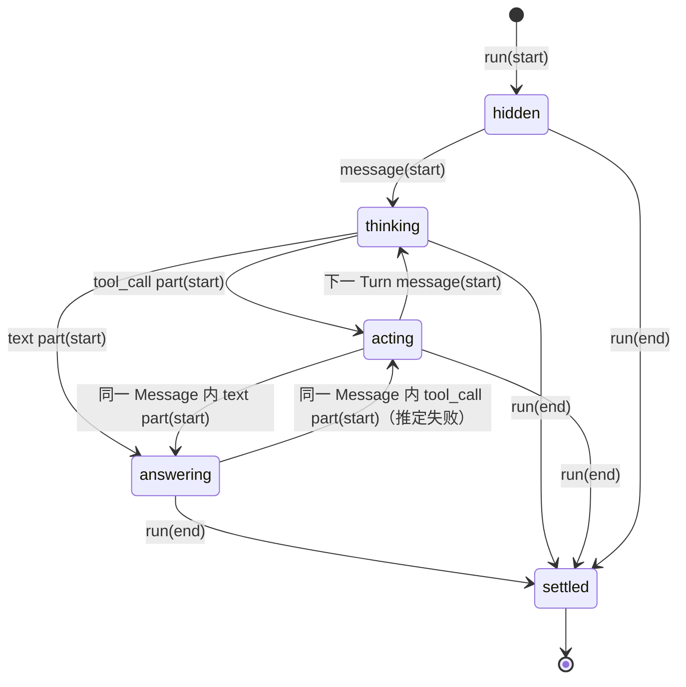

# 0030. Chain of Thought 的 runtime 阶段机与 Interim Output 归属

日期:2026-09-04
状态:已接受（2026-09-04，动效数值在 `/proto/cot-live` 上定案）

## 背景

ADR-0027 落地后，Live Chat 的 Chain of Thought（下称 CoT）在 runtime 时刻的表现由一个布尔 `isStreaming` 加两个 React `key`（`streaming` / `settled`）驱动。梳理现状（[agent-workspace.tsx](../../apps/desktop/src/pages/agent-workspace.tsx) 的 `AssistantRunTrace`、[chat-chain-of-thought.tsx](../../apps/desktop/src/shared/ui/chat/chat-chain-of-thought.tsx)）后发现实际跑出 5 个隐式状态，并且有五处不一致：

1. **没有「回答中」阶段。** 模型开始输出 Final Answer 的 text Part 后，CoT 仍停在最后一页 Thinking 或工具，头部仍写「Thinking…」，直到整个 Active Run 结束才折叠。
2. **两套计时。** Live 头部从 CoT 组件挂载起走表，而组件要等第一条 trace Part 到达才挂载；settled 后改用 `runModelElapsedMs`（各 Assistant Message start→end 求和，含写回答的时间）。数字在收束瞬间会跳。
3. **头部文案与视口内容脱节。** 视口显示工具行时头部仍是「Thinking…」。
4. **Interim Output 没有归属。** 非最后一个 Turn 的 text Part 与 Final Answer 同为 `chat` surface，以独立助手气泡呈现，而同一 Turn 的 Thinking 和 Tool Call 折在 CoT 里。
5. **已完成的过程在 run 期间不可见。** 一行视口只显示最新一项，前面 Turn 的思考和工具结果要等 run 结束才能展开看；多 Turn 的 run 里用户想回看「上一步查到了什么」做不到。

术语已补进 `CONTEXT.md`：Assistant Message、Message Part、Thinking、Tool Call、Tool Execution、Interim Output、Final Answer、Chain of Thought。本 ADR 用这套词重画阶段机。

## 决策

### 1. 阶段由 Session Projection 统一推导，组件只消费

为每个 Active Run 推导一个 `CotPhase`：

```ts
type CotPhase = "hidden" | "thinking" | "acting" | "answering" | "settled";
```

推导函数放在 `entities/session/`（与 `session-runtime-model.ts` 同层），输入是该 Run 的 runtime model 和 `streamingAllowed`（`projection.status === "running" && !projection.stale`），输出 `phase`、计时锚点、已完成步骤和进行中项。`ChatChainOfThought` 的 `isStreaming` prop 由 `phase` 取代；page 层不再用 `key` 切换。

推导规则（按优先级自上而下取第一个命中）：

| 阶段 | 条件 | 含义 |
|---|---|---|
| `settled` | `!streamingAllowed`，或该 Run 已收到 `run(end)` | 过程结束，无论 outcome |
| `answering` | 当前 Assistant Message 有 `text` Part 且没有 `tool_call` Part | 推定正在写（或已写完、等 `run(end)`）Final Answer。不用 `text.done === false`：那会在最后一个 token 到 `run(end)` 之间退回 `thinking`，与第 2 条状态图矛盾，计时也会跳 |
| `acting` | 存在 Tool Execution 状态为 `announced` 或 `running`，或当前 Assistant Message 最新的 Part 是 `tool_call` | 模型在发调用或工具在跑 |
| `thinking` | 当前 Assistant Message 存在 `thinking` Part，或 Message 已 start 但尚无 Part | 模型在推理或刚被调用 |
| `hidden` | 该 Run 尚无 Assistant Message start（含 abandoned 的） | 还在等第一次模型调用。retry 期间 abandoned 的 Message 已被剔除、替代的还没 start 时，阶段停在 `thinking`、锚点暂缺，CoT 不闪退 |

「当前 Assistant Message」指该 Run 最后一条未 abandoned 的 Assistant Message。abandoned 的 Message 从推导输入中剔除，它的 Part 不进 CoT。

### 2. 阶段转移



要点：

- `answering → acting` 是合法回退。Live 阶段把 text 推定为 Final Answer，Message 结束时发现含 Tool Call，则该 text 被重分类为 Interim Output（见第 7 条），阶段回到 `acting`。
- `settled` 只由 `run(end)` 或 `streamingAllowed` 变假触发，不由「最后一条 Message 变 final」触发。Message final 但 Run 未结束时，下一步一定是 `acting`（工具在跑）或 `thinking`（下一 Turn 开始）。
- retry：abandoned 的 Message 被剔除后按同一规则重算，不设专门阶段；retry 本身继续以 `status` 事件进 trace。
- abort / failed：一律进 `settled`，CoT 收束为「Thought for Ns」；失败原因由既有的 error 气泡承担，CoT 不重复表达。

### 3. CoT 是一列同形的 step，最后一条可以是活的

run 期间和 settled 之后是同一个列表，不再有「视口」「尾巴」这类单独的活区域。列表里只有三种行，全部是「动词 + 对象 + 耗时」的一行：

```
Worked for 16s ⌄                    头部：settled 后出现，折叠整列
  Thought 2s ⌄                      Thinking 是一个 step，有正文可展开
  先看一下现有的计时实现和它的测试。   Interim Output 作为正文夹在行间
  ✓ Searched 1 pattern, read 1 file · 750ms ⌄   一批 Tool Call = 一条动词总结行
  Thought briefly
  Running bash… ⌄                   活的 step：正在跑的那批工具，名字在调用间翻页
  ▪ Working… 26.4s                  状态行：loader + shimmer 状态词 + 走表
```

- **Thinking 是 step，不是正文。** 折叠时「Thought 2s」（不足 1s 写「Thought briefly」），有正文可展开读，正文用 `ChatThoughtMarkdown`；活的那条 label 是带 `TextShimmer` 的「Thinking…」，展开可以看流式正文。没有正文（provider 只给摘要、`redacted_thinking`、关掉 thinking）就是一行干净的「Thought 2s」，不需要特殊状态。这条决策的出发点就是 thinking 内容不由我们控制。
- **Interim Output 是正文行**，用 `--color-text-primary`，比 step 行深一档，因为它是对用户说的话。
- **一批 Tool Call 是一个 step。** 同一 Message 里连续的 Tool Call 合成一条。活着的时候 label 是「Running {正在跑的工具}…」，Pi 顺序执行，所以是第一个未执行完的那一个；换工具时这行的名字翻页（上移翻出、下方翻入），是整个 CoT 里唯一保留的翻页动画，节奏由工具执行时长决定，天然间隔在几百毫秒以上，再加一个最小停留（原型默认 700ms）兜底。执行完后一律收成动词总结行：一个工具是「动词 + 对象」，如「Read agent-workspace.tsx」「Ran bun vitest run …」（路径保尾、命令保头，超长截断）；多个是按工具类型归并的计数，如「Ran 2 commands, edited 3 files」（bash → Ran N commands，read → Read N files，edit / write → Edited / Wrote N files，grep / find / ls → Searched / Listed，其余 → Used N tools）。行末跟失败数和总耗时，展开是每个工具各自的生产 `ChatToolGroup` 单行。一个工具就是只有一个元素的一批，不另设形状；也不用「最后一个工具名 + 数量」那种折叠摘要，它把一批读成一个。
- **状态行**永远是最后一行，只在 `thinking` / `acting` 阶段存在：像素格 loader、带 shimmer 的状态词、走表计时。状态词每 4 秒换一个，`thinking` 从「Thinking / Pondering / Exploring / Connecting dots…」取，`acting` 从「Working / Digging in / Checking / Following the trail…」取。它是情绪层，不承载信息；信息在 step 行里。心跳只有这一处。
- **头部只在 `settled` 出现。** run 期间和 `answering` 期间列表都平铺、没有头部，回答在列表下方流式出现；`run(end)` 时整列折进「Worked for Ns」，默认折叠，点开还是同一列。折叠只发生一次：原型里试过在 `answering` 就折，`answering → acting` 回退时头部会闪现又消失。步骤为空且无计时时头部退化为 `Label`。文案用 Worked 不用 Thought，因为计时口径包含工具执行（第 6 条）。

### 4. Tool Call 一出现就上行，不等执行

工具 step 在 `tool_call part(start)` 时立即出现，label 已经是「Running {name}…」，参数流式期间对应 `ChatToolGroup` 的 `input-streaming`；`part(end)` 后转 `input-available`；`tool(start)` 转 `running`；`tool(end)` 转 `done`，全批执行完后 label 换成过去式总结。理由：大参数（如整文件 edit）可能流几秒，若等执行才显示，上一条 Thought 会看起来卡住；且进入 `acting` 的触发本就是 `tool_call part(start)`。

### 5. 每个阶段的呈现与动画

| 阶段 | 头部 | step 列表 | 状态行 | 动画 |
|---|---|---|---|---|
| `hidden` | 不渲染 CoT | 无 | 无 | 无；「contacting model / stalled」占位仍由 page 层 1s 时钟负责 |
| `thinking` | 无 | 平铺，最后一条是「Thinking…」 | loader + 状态词 + 走表 | shimmer；像素格 650ms 逐格心跳 |
| `acting` | 无 | 平铺，最后一条是「Running {tool}…」 | 同上 | 心跳持续；换工具时名字翻页，最小停留 700ms |
| `answering` | 无 | 平铺，最后一条已是过去式 | 撤下 | loader 卸载；回答在列表下方流式出现 |
| `settled` | 「Worked for Ns」或 `Label` | 折进头部，默认折叠 | 无 | 列表高度折叠（Base UI `--collapsible-panel-height` 过渡）；ActionBar `--duration-fast` 淡入并常显 |

`answering → acting` 回退时只是回答气泡撤下、列表继续长，没有头部参与，因此没有跳变。减动效下翻页和折叠过渡都关掉，直接切换。

### 6. 计时只有一个锚点

- **锚点** = 该 Active Run 第一条非 abandoned Assistant Message 的 `startedAt`。Live 与 settled 共用这个锚点，数字不再跳。
- **Live 计时** = `now − 锚点`，100ms 走表，仅在 `thinking` / `acting` 阶段推进。
- **冻结点** = 进入 `answering` 的时刻，也就是推定 Final Answer 的 text Part 的 `start`。回退到 `acting` 后恢复走表。
- **Settled 数值** = Final Answer 所在 Message 内第一个 `text` Part 的 `startedAt` − 锚点；没有 text Part（abort、失败）时用该 Message 的 `updatedAt`。
- 「Thought for Ns」的口径因此是**用户等到回答开始所花的墙钟时间**，覆盖推理、发调用和工具执行，不含写回答的时间。这与 ADR-0027 之后 `runModelElapsedMs` 的「各次模型调用求和」口径不同，本 ADR 取代它。
- `startedAtMs` prop 保留为唯一的计时入口；组件不再从挂载时刻起表。`streamingAllowed` 为假时不走表，回放 fixture 不会因历史时间戳出错。

### 7. Interim Output 的归属

- Live 阶段一切 `text` Part 先按 Final Answer 呈现为回答气泡（`answering`）。理由：绝大多数 Run 只有一个 Turn，先按回答呈现的误判成本最低。
- 同一 Assistant Message 里一出现 `tool_call part(start)`，该 text 就被重分类为 Interim Output，不必等 `message(end)`，那一刻已经能确定：回答气泡撤下，文本作为一项进入步骤栈，位置在同 Message 的 Thinking 之后、Tool Call 之前，用 `ChatThoughtMarkdown` 渲染，颜色用 `--color-text-primary`，比 Thinking 深一档，因为它是对用户说的话。
- 一个 Run 因此至多一个回答气泡（Final Answer），ActionBar 也只挂在它上。
- **`settled` 时的归属**：Run 结束后不会再有后续 Message 来占据回答位，因此当前 Message 只要有 text Part，其文本就是 Final Answer，即使同一 Message 里还有 Tool Call（Stop 或失败打断发调用时的常见形状）。否则模型最后说的话会被折进 CoT，气泡空着、也没有 ActionBar。
- 协议不变：Interim / Final 是 projection 的推导标签，`surfaceForMessagePart` 仍按 partType 路由；重分类发生在 renderer 的 projection 层。

### 8. 动效数值（原型定案）

在 `/proto/cot-live` 用 54 秒、6 Turn、7 种工具、含报错和长输出的 mock run 反复回放后定下：

| 参数 | 值 | 含义 |
|---|---|---|
| flip | 300ms | 翻页动画时长：工具名切换、「Running x…」→ 过去式总结、「Thinking…」→「Thought Ns」，以及 settled 时整列折进头部的高度过渡。对应 `--duration-slow-max` 的话要确认它就是 300ms，否则用独立常量 |
| dwell | 700ms | 翻页最小停留，下限钳到 flip |
| pixel | 860ms | 像素格心跳周期。比现有生产 loader 的 650ms 慢，落地时一起改 |
| during run | flat | run 期间 step 列表平铺，settled 才折进「Worked for Ns」 |

原型里试过并否决的数值：flip 935ms（`--duration-slow-max` 被误用时的实际值，拖沓）；pixel 650ms（在状态行上显得急）。

## 否决

- **维持 `isStreaming` 布尔 + `key` 重挂。** 表达不了 `answering`，也没法让头部文案跟着尾巴变。
- **run 期间整段只有一行视口（ADR-0027 第 1 条）。** 多 Turn 时用户回看不了上一步的工具结果；已完成的项没有理由藏到 run 结束。
- **run 期间默认折叠、只露一行尾巴。** 中途版本试过「头部 + 折叠栏 + 一行尾巴」：每个 step 只有一行，六个 Turn 也就十来行，折叠省下的空间不值得让用户点开才知道过程在推进。改成平铺、settled 再收。
- **Thinking 正文做一行流式视口、按句翻页。** 中途版本试过：分句要认中日文标点、要加最小停留才不乱，省略号截掉长句，而主力 provider 给的本来就是摘要甚至空的。改成 Thought step，想看正文点开。
- **Tool Call 等到 `tool(start)` 才显示。** 参数流式期间尾巴会假死。
- **loader 放头部，或挂在活的那一行的行首 / 行末。** 原型里都试过：放头部时下面在动的行没有指向；行末随文字长短左右跳；行首和工具行自己的图标打架。单独一行状态行最稳，也和用户熟悉的桌面 agent 一致。
- **一组工具复用「最后一个工具名 + 数量」的折叠摘要。** 读者会把一组误读成一个工具，也看不出这组干了什么。
- **翻页由 `pageKey` 变化立即触发、无节流。** 连续切换时前一次被丢弃，视觉跳变；保留的工具名翻页加最小停留。
- **头部叫「Thought for Ns」。** 口径包含工具执行时间，叫 Thought 名不副实。
- **先把 text 扣在 CoT 里，Message 结束确认为 Final 再放出。** 单 Turn 占多数，回答要等到 Message 结束才出现，Live 体验倒退。
- **Interim Output 保留为独立气泡。** 多气泡打断回答；它和 Thinking 同属过程内容，读者不需要在两处找过程。
- **「Thought for Ns」继续用模型调用时长求和。** 它把写回答的时间算进「思考」，又漏掉工具执行时间，和用户实际等待感受都对不上。
- **给 abort / retry 设专门阶段。** 它们已有 error 气泡和 trace status 承载，CoT 再表达是重复。

## 后果

- **取代 ADR-0027 的第 1、2 条**：流式不再是「不可展开的一行视口」，而是平铺的 step 列表；心跳从头部移到底部状态行；收束时机从 run(end) 前移到 `answering`；「Thought for Ns」改为「Worked for Ns」。一行视口和它的分句 pager（`liveThoughtLine` / `thoughtBeats`）退役，翻页容器只保留给工具名切换。其余（`ChatThoughtMarkdown` 渲染正文、ActionBar 常显、Rail 独立）不变。
- `SessionRuntimeMessagePart` 需要增加 `startedAt`（part(start) 时刻），否则第 6 条的冻结点与 settled 数值无法测量。这是唯一的数据层改动。
- `ChatChainOfThought` API：`isStreaming` → `phase: CotPhase`；`Live` 视口和 `LiveStatus` 退役；新增 `StatusLine`（loader + 状态词 + 走表）；像素格 loader 提为 `shared/ui/` 公开原子并登记到 `/design`。
- 翻页容器要有一个**行内版本**（`span`、`inline-flex`、无外边距、带最小停留），供 step 行的 label 使用；现有 `.chain-of-thought__live` 是块级且带 8px 上外边距，直接塞进按钮会让文字低于箭头中线。
- 新增两个 step 组件到 `shared/ui/chat/` 并登记 `/design`：`ChatThoughtStep`（Thought Ns / Thinking… 可展开正文）和 `ChatToolStep`（活着「Running x…」翻页、收束后动词总结行加展开列表）。`ChatToolGroup` 只在展开列表里以单行形态出现，它的多工具折叠形态不再在 CoT 里使用。
- `AssistantRunTrace` 不再自己判断阶段和 `key`；`LiveTracePage` 与 `groupTimelineSteps` 共用一个 `RunTimelineItem → ChatToolItem` 映射，且以「是否完成」而非「是否最后一项」划分栈和尾巴。
- 两处布局前提要在落地时一起修，原型里都踩到了：一行尾巴的 nowrap 文本会把自己的完整宽度当 min-content 向上传，把消息体撑出聊天列，需要在 `Live` 容器上加 `contain: inline-size`；Astryx 把助手消息体按 `align-items: start` 排成 fit-content，一旦尾巴被包含、栈又折叠，整块会缩到只有头部宽，需要让含 CoT 的消息体 `align-self: stretch`。两者已在落地时一并处理（`.chain-of-thought` 的 `contain: inline-size` 与 `.chat-message__body:has(> .chain-of-thought)` 的 `align-self: stretch`），`Live` 视口本身已删除。
- `runModelElapsedMs` 与 legacy 的 `thoughtElapsedMs` 退役；legacy `runtimeEvents` 管道没有 Message 边界，其 CoT 只能停在 `settled` 且无计时，这与既有「删除 legacy 管道」的注记一致。
- 测试：阶段推导函数用 ADR-0020 的六条 fixture 流（纯文本、thinking+text、tool 链、多 Turn、retry、abort）断言完整阶段序列、计时锚点和栈 / 尾巴划分；组件测试改为按 `phase` 断言头部、栈、尾巴和心跳位置。
- 如日后接通 Rail 皮肤（issue #81），它必须消费同一个 `CotPhase`，其「流式默认展开」的测试需要改写。
