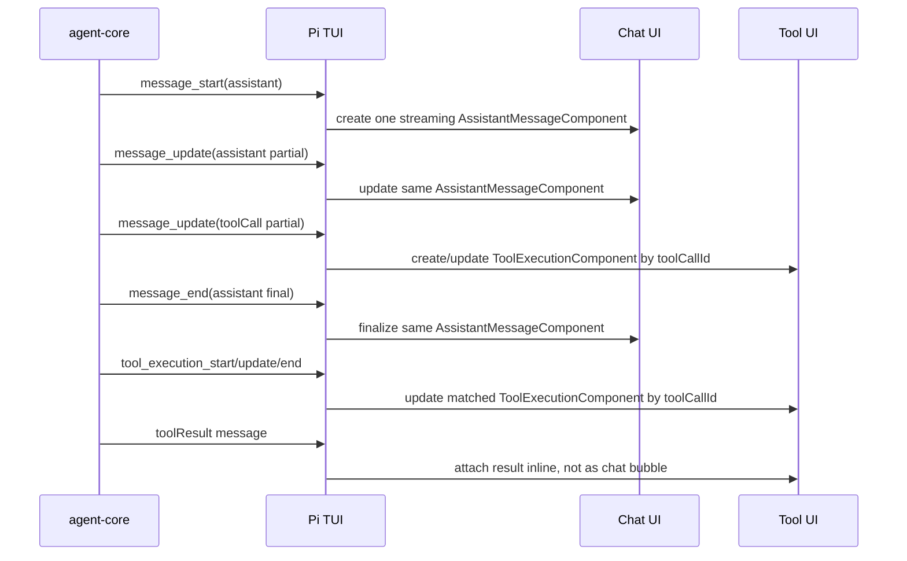

# Agent Runtime Event Model handoff

## 背景

目标是让 PiGUI 像 Pi TUI 一样稳定地表达一次 agent run：同一个 assistant 输出在流式更新时只占一个消息边界，thinking、tool call、tool result、status 和最终回答各自进入正确的 UI surface，而不是都被挤进 Live Chat bubble。

PR #33 已经修掉最明显的 Live Chat 重复 bubble 问题，但它是过渡修复，不是最终协议设计。下一步应该补一层明确的 Agent Runtime Event Model，而不是继续让 renderer 从扁平事件里猜边界。

## 当前现状

现有稳定边界仍是 ADR-0018 里定义的 Runtime Gateway：renderer 不直接依赖 Pi SDK 或 Pi RPC，后端 driver 负责把 Pi 接入方式映射成 PiGUI 产品语义。

PR #33 之后，当前实现做了这些收敛：

- `PiRuntimeEvent` 增加了 `messageId`、`toolCallId`、`thinking`、`tool-result`、`bodyFormat`、`phase` 等字段。
- `pi-sdk-runtime-adapter` 会把 SDK 的 assistant text/thinking/tool 事件映射成 Gateway event，并用本地 `assistant.index` 生成 synthetic `messageId`。
- `session-projection` 会按 `(piSessionId, kind, messageId)` 或 `(piSessionId, kind, toolCallId)` upsert runtime event，避免每个 stream update 都追加成新消息。
- `agent-workspace` 只把 message/control/error 放进 Live Chat；thinking 和 tool events 进入 Agent Trace 风格的 timeline；历史消息用普通 Markdown，只有当前 running assistant message 用 streaming markdown。
- 为了止血，Live Chat 仍有 `collapseAssistantRunMessages()`：它会把相邻 assistant answer 合并成一个 bubble，并保留 `relatedMessageIds` 让 trace 还能挂回去。

这说明当前系统已经知道“哪些事件不应该成为 chat bubble”，但这个知识分散在 adapter、projection 和 page 组件里，还没有沉淀成协议。

## 现有问题

当前问题不是 `PiSdkDriver` 或 `RuntimeGateway` 太薄。driver 和 gateway 薄是合理的：它们应该处理 session 生命周期、命令转发、event envelope、seq、snapshot，而不是承担 UI 语义。

真正薄的是 SDK/raw event 到 PiGUI event 的语义归一层：

- 现在 Gateway payload 仍接近 `{ kind, role, body, messageId, toolCallId, phase }`，缺少一套明确的 agent-run lifecycle 类型。
- `messageId` 仍可能是 synthetic id，不是 agent-core 原生 message identity；遇到多 assistant item、多 turn、retry、tool interleave 时，边界仍可能靠推断。
- `phase` 只有 `partial | delta | final`，但它同时被用来表达 message lifecycle、tool lifecycle 和 rendering lifecycle，语义过载。
- UI surface 没有进入协议，导致 renderer 还要判断哪些进入 `chat`、哪些进入 `trace`、哪些只是 `status`。
- `turnId` 在 Gateway envelope 中存在，但当前还不是 Live Chat bubble 和 trace 归属的权威边界。
- `collapseAssistantRunMessages()` 是 UI 层补丁。它能修复相邻重复 assistant bubble，但不应该成为长期消息边界算法。

## TUI 的可学习模型

Pi TUI 不是从文本 delta 猜消息边界，而是跟随 agent-core 的结构化生命周期：



关键点：

- `message_start` 创建 assistant streaming component。
- `message_update` 只更新同一个 streaming component。
- `message_end` finalize 并清空 streaming state。
- `tool_execution_*` 按 `toolCallId` 更新 tool component。
- 历史回放时，assistant message 先渲染，message 内的 `toolCall` 创建 tool component；后续 `toolResult` message 只匹配并更新 tool component，不单独渲染成 chat message。

这套模型的核心不是组件本身，而是边界来源：边界来自 agent-core lifecycle 和 message content structure，不来自 UI 对相邻文本事件的猜测。

## 建议设计方向

新增一个明确的 Agent Runtime Event Model，放在 Runtime Gateway 与 renderer 之间，作为 PiGUI 的产品层事件契约。它不应该裸透 Pi SDK 类型，但应该保留 agent-core 的生命周期语义。

建议至少分成这些概念：

- `runId`：一次 send/steer/follow-up 触发的 active run。
- `turnId`：agent loop 中一次 model response + tool execution 循环的边界。
- `messageId`：一个 agent message 的稳定 identity；优先使用 agent-core/session message id，缺失时由 normalizer 明确生成并记录来源。
- `partId`：同一 assistant message 内 text/thinking/toolCall block 的 identity。
- `toolCallId`：tool call 与 tool result 的匹配键。
- `phase`：lifecycle phase，建议收敛为 `start | update | end`，不要继续把 `delta` 当生命周期。
- `bodyMode`：内容模式，单独表达 `delta | snapshot`，避免和 lifecycle 混在一起。
- `partType`：`text | thinking | tool_call | tool_result | status | error | usage | control`。
- `surface`：`chat | trace | status | composer | hidden`，由协议告诉 UI 该去哪里，不让 page component 猜。

示例事件形状可以先这样设计：

```ts
type AgentRuntimeEvent =
  | {
      type: "message";
      runId: string;
      turnId: string;
      messageId: string;
      role: "user" | "assistant";
      phase: "start" | "update" | "end";
      bodyMode: "delta" | "snapshot";
      parts: AgentMessagePart[];
      surface: "chat";
    }
  | {
      type: "tool";
      runId: string;
      turnId: string;
      toolCallId: string;
      phase: "start" | "update" | "end";
      name: string;
      args?: unknown;
      result?: unknown;
      isError?: boolean;
      surface: "trace";
    }
  | {
      type: "status";
      runId?: string;
      code: string;
      body?: string;
      surface: "status" | "composer" | "hidden";
    };
```

## 迁移建议

1. 先写契约测试，不改 UI。
   - 使用 fake agent-core event stream 覆盖：纯文本流、thinking + text、assistant -> toolCall -> toolResult -> assistant、多 turn、retry/error/abort。
   - 断言 normalized events 的 `runId/turnId/messageId/toolCallId/phase/surface`。

2. 把归一逻辑从 `pi-sdk-runtime-adapter.ts` 中抽出来。
   - 新建类似 `agent-runtime-event-normalizer.ts` 的模块。
   - `PiSdkRuntimeAdapter` 只负责把 SDK subscription 接进 normalizer。
   - RPC driver 也映射到同一模型，能力不足时显式标 `source: "rpc"` 或缺口。

3. 让 `session-projection` 以 Agent Runtime Event Model 为输入。
   - Projection 负责保存 query model，不再发明 chat bubble 边界。
   - Upsert key 来自协议 identity，而不是 renderer 侧拼接。

4. 简化 `agent-workspace.tsx`。
   - Live Chat 只渲染 `surface: "chat"` 的 finalized/streaming message。
   - Trace 只渲染 `surface: "trace"` 的 thinking/tool/result。
   - 删除或降级 `collapseAssistantRunMessages()`；它最多作为兼容旧事件的 fallback。

5. 再考虑持久化和 replay。
   - 历史 session 不应从头播放 streaming markdown。
   - Snapshot/replay 应直接加载 normalized projection：当前 active message 可 streaming，历史 message 都是 static。

## 开放问题

- Pi SDK / agent-core 是否能提供稳定的 message id？如果没有，normalizer 生成 id 的规则要成为契约，并持久化，不能只靠进程内 index。
- `turnId` 应由 agent-core 暴露、Gateway 生成，还是由 run/turn normalizer 基于 lifecycle 推导？这会影响 retry 和多 turn 工具链。
- thinking 是否应作为 assistant message part，还是单独 trace item？UI 可以分开，但协议最好能表达二者同属一个 message/turn。
- tool call 的 args 应该来自 assistant message content，还是来自 `tool_execution_start`？TUI 两条路径都处理，PiGUI 需要定义合并优先级。
- runtime unavailable、model first-token timeout、retry/compaction 等状态应该进入 chat、composer hint、banner，还是 trace status？这应由 `surface` 决定。

## 下一步最小切片

下一步不要先改视觉。建议先做一个小 PR，只做契约和 normalizer：

- 新增 `AgentRuntimeEvent` 类型和 normalizer tests。
- 用 agent-core/TUI 风格 fixture 覆盖 4 条核心流。
- 让 SDK adapter 输出新模型，再在旧 `PiRuntimeEvent` 上做一层兼容映射。
- 确认现有 Live Chat UI 行为不回退。

这样下一轮 UI 设计可以基于稳定事件模型，而不是继续在页面里修补边界。
